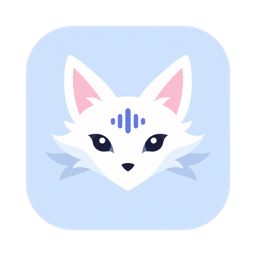
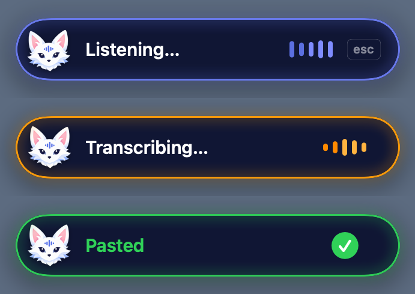

<p align="center">
  
</p>

<h1 align="center">Foxtation</h1>

<p align="center">
  Local voice dictation for macOS. Hold a key, speak, and a little fox types it for you.<br>
  Everything runs on your Mac — no audio, text or telemetry ever leaves it.
</p>

<p align="center">
  
</p>

---

## Features

- **Hold to talk** — hold right <kbd>⌥</kbd>, speak, release. The text lands in whatever field has focus: editors, terminals, browsers, chat apps.
- **Hands-free** — double-tap right <kbd>⌥</kbd> to keep listening, tap again to stop.
- **On-device Whisper** — `whisper-large-v3-turbo` on the Apple GPU via MLX, or whisper.cpp.
- **Many languages** — Indonesian, English, auto-detect and more, switchable straight from the menu bar.
- **Stays out of the way** — a small pill at the top of the screen, never steals focus, your clipboard is restored after pasting.

## Install

Requires macOS 14 or later on Apple silicon.

### Homebrew

```sh
brew install --cask khmuhtadin/tap/foxtation
```

### DMG

1. Download `Foxtation-x.y.z.dmg` from [Releases](https://github.com/khmuhtadin/foxtation/releases) and drag **Foxtation** into **Applications**.
2. Foxtation isn't notarized by Apple yet, so the first launch is blocked. Open it once, then go to **System Settings › Privacy & Security** and click **Open Anyway** — or run:

   ```sh
   xattr -dr com.apple.quarantine /Applications/Foxtation.app
   ```

The MLX engine also needs [uv](https://docs.astral.sh/uv/) (`brew install uv`). Homebrew installs it for you.

## First run

1. Look for the fox in the menu bar and open **Settings…**.
2. **Engine** — press **Set Up** to create the MLX runtime (about 200 MB), then download a model. *Large v3 Turbo* is the default.
3. **General › Permissions** — allow **Microphone**, then **Accessibility**. Accessibility is what lets Foxtation paste into other apps.

## Usage

| Action | How |
|---|---|
| Dictate | Hold right <kbd>⌥</kbd>, speak, release |
| Hands-free | Double-tap right <kbd>⌥</kbd>, speak, tap once to stop |
| Shortcut | <kbd>⌃</kbd><kbd>⌥</kbd><kbd>⌘</kbd><kbd>D</kbd> to start, again to stop (configurable) |
| Cancel | <kbd>Esc</kbd> |
| Change language | Menu bar fox › **Language** |
| Copy last result | Menu bar fox › **Copy Last** |

Typing with right <kbd>⌥</kbd> (é, ™, ⌥⌫…) still works — a key combination is recognised as typing, not dictation.

## Engines

Switch in **Settings › Engine**.

| | MLX Whisper (default) | whisper.cpp |
|---|---|---|
| Runs on | Apple GPU via [MLX](https://github.com/ml-explore/mlx) | CPU/GPU via [whisper.cpp](https://github.com/ggml-org/whisper.cpp) |
| Models | Large v3 Turbo, 4-bit, Small, Base, Tiny | ggml `.bin` files |
| Install | from the app (needs `uv`) | `brew install whisper-cpp` |
| Short clip | ~3.5 s | ~2 s |
| 15 s clip | ~4 s | ~10 s |

MLX keeps the model loaded in a background worker, so its load time is paid once. whisper.cpp starts fresh for every clip — quicker for very short ones, slower as clips get longer. Measured on an M4 with 16 GB.

## Privacy

Audio is recorded to a temporary file, transcribed locally and deleted. Nothing is sent anywhere. Model weights are downloaded once from Hugging Face; after that Foxtation works offline.

## Command line

The app binary can transcribe a file without opening the UI:

```sh
/Applications/Foxtation.app/Contents/MacOS/Foxtation --transcribe clip.wav --language id
```

Options: `--engine mlx|cpp`, `--model <name or path>`, `--language <code>`, `--translate`, `--prompt <text>`. The transcript goes to stdout.

## Build from source

Needs the Xcode Command Line Tools (`xcode-select --install`).

```sh
git clone https://github.com/khmuhtadin/foxtation.git
cd foxtation
./build.sh               # → dist/Foxtation.app
open dist/Foxtation.app
```

`scripts/make-dmg.sh` builds a release disk image. See [docs/RELEASING.md](docs/RELEASING.md).

<details>
<summary>Project layout</summary>

```
Sources/Foxtation/      Swift app: menu bar, recorder, engines, settings
  HUD/                  the dictation pill and the fox's entry flight
Resources/              Info.plist, MLX worker, icons, fox poses
assets/                 icon and mascot sources plus the scripts that process them
docs/                   storyboard, screenshots, release notes
packaging/homebrew/     Homebrew cask
scripts/                release tooling
```

App data lives in `~/Library/Application Support/Foxtation/`; Whisper weights in `~/.cache/huggingface/hub/`.

</details>

## License

[MIT](LICENSE) © 2026 Khairul Muhtadin
